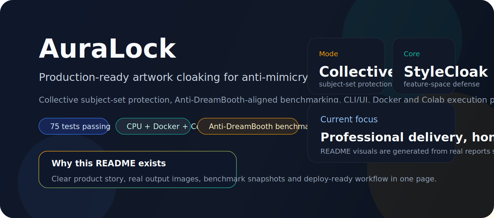
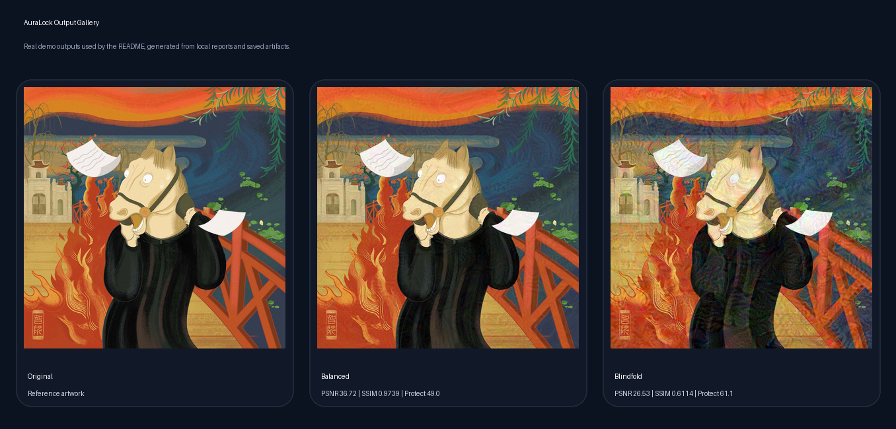
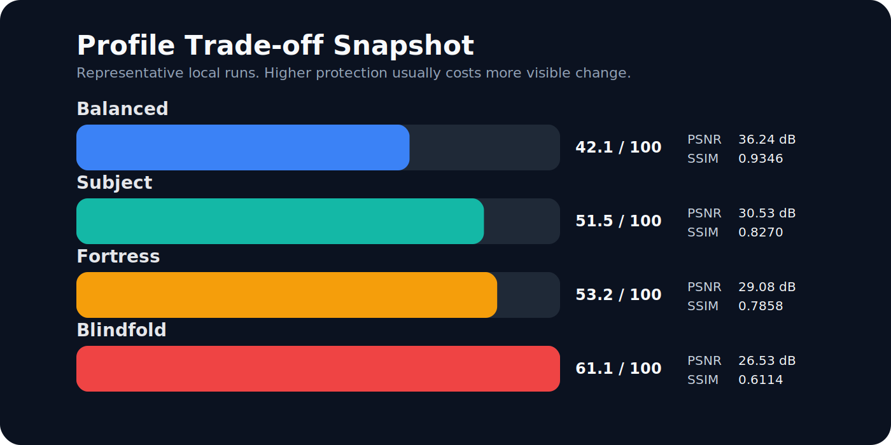
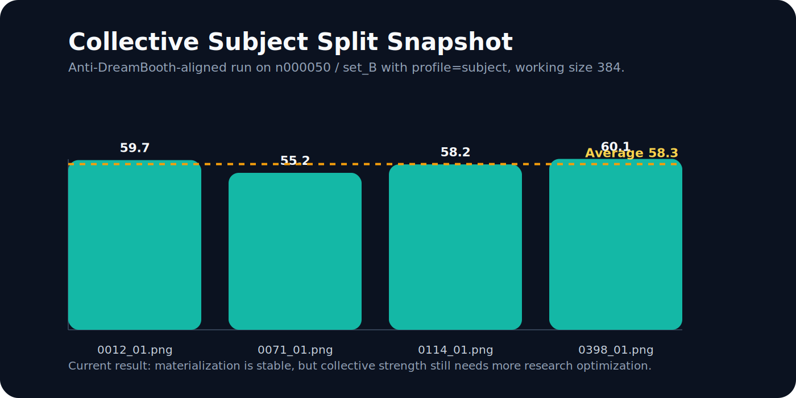
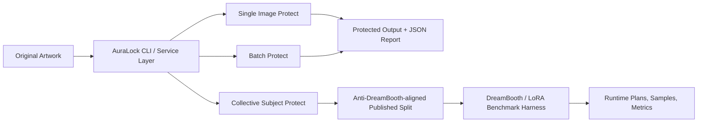

# AuraLock

<p align="center">
  
</p>

<p align="center">
  <strong>Production-oriented artwork cloaking pipeline for anti-mimicry workflows.</strong><br/>
  Protect single images, whole folders, and Anti-DreamBooth-style subject splits with one consistent CLI/service layer.
</p>

<p align="center">
  
  
  
  
  
  
</p>

<p align="center">
  <a href="#-cài-đặt-nhanh">Quick Start</a> •
  <a href="#-cách-sử-dụng">CLI</a> •
  <a href="#-profiles">Profiles</a> •
  <a href="#-benchmark">Benchmark</a>
</p>

## 🎯 Giới thiệu

**AuraLock** là một toolchain bảo vệ hình ảnh cho nghệ sĩ và đội sản phẩm AI-safety. Mục tiêu của dự án không phải hứa hẹn phép màu kiểu "mọi AI đều mù ảnh", mà là cung cấp một pipeline vận hành được để:

- giữ ảnh đủ dùng cho con người
- làm khó hơn việc trích feature, mimic style và benchmark DreamBooth/LoRA
- đo lại bằng metric thật thay vì chỉ dựa vào demo cảm tính

README này dùng **asset sinh từ dữ liệu thật của repo**. Banner, chart và gallery được tạo từ [`scripts/generate_readme_assets.py`](scripts/generate_readme_assets.py), không phải mockup thủ công.

## ✨ Product Snapshot

| Khối | Hiện có |
|------|---------|
| **Protection engine** | `StyleCloak` mặc định, profile `safe`, `balanced`, `strong`, `subject`, `fortress`, `blindfold` |
| **Operational modes** | single image, directory batch, adaptive guardrails, collective subject-set batch |
| **Benchmarking** | profile benchmark, LoRA manifest, Anti-DreamBooth split harness, Docker GPU runtime, Colab notebook |
| **Interfaces** | CLI, optional Gradio UI, JSON reports, Docker web runtime |
| **Quality gates** | `pytest`, `ruff`, `black`, CI workflow |

## 🖼️ Visual Snapshot



## 📊 Benchmark Snapshot





## 🧭 Workflow



## 🧱 Tính năng

- 🛡️ **StyleCloak mặc định**: Bảo vệ theo feature/style-space, lấy cảm hứng từ Mist-v2, StyleGuard, Anti-DreamBooth và MetaCloak
- 🎚️ **Protection Profiles**: `safe`, `balanced`, `strong`, `subject`, `fortress`, `blindfold`
- 👥 **Collective Subject Mode**: Tối ưu cả subject set trong một lượt thay vì protect từng ảnh rời độc lập
- 📊 **Quality + Readability Metrics**: Đo PSNR, SSIM, embedding similarity, robust style similarity
- 🧾 **JSON Reports**: Xuất report machine-readable cho `protect`, `batch`, `analyze`
- 🧪 **Benchmark Runner**: So profile trên file/thư mục và aggregate metric theo profile
- 🚢 **Docker GPU Benchmark Runtime**: Tách môi trường train DreamBooth/LoRA khỏi runtime chính
- ☁️ **Google Colab Notebook**: Đường chạy free-GPU cho benchmark dry-run và execute
- 🌐 **CLI + Web UI**: CLI là đường vận hành chính; Gradio UI là lớp demo/ops nhẹ

## 🚀 Cài đặt nhanh

```bash
# Clone repo
git clone https://github.com/locfaker/AuraLock.git
cd AuraLock

# Tạo môi trường ảo
python -m venv venv
.\venv\Scripts\activate  # Windows
# source venv/bin/activate  # Linux/Mac

# Cài đặt dependencies lõi
pip install -e ".[dev]"

# Nếu muốn benchmark LoRA/DreamBooth thật
pip install -e ".[benchmark,dev]"

# Nếu muốn chạy Web UI
pip install -e ".[ui,dev]"
```

## 💻 Cách sử dụng

### 1. Command Line (CLI)

```bash
# Bảo vệ một ảnh
auralock protect artwork.png -o protected.png

# Chọn profile mạnh hơn và xuất report JSON
auralock protect artwork.png -o protected.png --profile strong --report reports/protect.json

# Adaptive mode: tự tăng profile đến khi đạt ngưỡng hoặc fail rõ ràng
auralock protect artwork.png -o protected.png --auto-profiles safe,balanced,strong,subject,fortress,blindfold --min-protection-score 25 --min-ssim 0.92 --min-psnr 35 --report reports/protect-adaptive.json

# Mode obfuscation mạnh để AI khó đọc hơn, chấp nhận nhiễu thấy rõ
auralock protect artwork.png -o protected-blindfold.png --profile blindfold --report reports/protect-blindfold.json

# Bảo vệ cả thư mục ảnh
auralock batch ./artworks ./protected --recursive

# Bảo vệ batch với report JSON
auralock batch ./artworks ./protected --recursive --profile safe --report reports/batch.json

# Bảo vệ cả subject set theo collective mode, dùng một working size chung
auralock batch ./.cache_ref/Anti-DreamBooth/data/n000050/set_B ./protected_subject --profile subject --collective --working-size 384 --report reports/batch-collective.json

# So sánh hai ảnh
auralock analyze original.png protected.png

# So sánh hai ảnh và lưu report
auralock analyze original.png protected.png --report reports/analyze.json

# Dùng attack classifier cũ để đối chiếu
auralock protect artwork.png -o protected-fgsm.png --method fgsm -e 0.03

# Benchmark các profile trên một ảnh hoặc cả thư mục
auralock benchmark artwork.png --profiles safe,balanced,strong --report reports/benchmark.json

# Lập manifest benchmark DreamBooth/LoRA thật (dry-run, có cả baseline clean)
auralock benchmark-lora ./artworks --work-dir benchmark_runs/lora --pretrained-model-path ./stable-diffusion/stable-diffusion-1-5 --script-path ./.cache_ref/Anti-DreamBooth/train_dreambooth_lora.py --instance-prompt "a sks painting" --class-prompt "a painting" --report reports/lora-manifest.json

# Lập manifest benchmark theo split Anti-DreamBooth (set_A/set_B/set_C)
auralock benchmark-antidreambooth ./.cache_ref/Anti-DreamBooth/data/n000050 --profiles safe --pretrained-model-path ./stable-diffusion/stable-diffusion-2-1-base --report reports/antidreambooth-manifest.json

# Chỉ dùng --execute khi máy đã có CUDA, đúng script path, checkpoint Diffusers hợp lệ (có model_index.json), và bộ runtime benchmark

# Chạy benchmark trong Docker GPU runtime
auralock benchmark-lora-docker ./artworks --workspace-dir . --pretrained-model-path ./stable-diffusion/stable-diffusion-1-5 --script-path ./.cache_ref/Anti-DreamBooth/train_dreambooth_lora.py --infer-script-path ./.cache_ref/Anti-DreamBooth/infer.py --instance-prompt "a sks painting" --class-prompt "a painting" --report reports/lora-docker.json

# Chỉ thực thi train/infer khi Docker GPU đã sẵn sàng
auralock benchmark-lora-docker ./artworks --workspace-dir . --execute --pretrained-model-path ./stable-diffusion/stable-diffusion-1-5 --script-path ./.cache_ref/Anti-DreamBooth/train_dreambooth_lora.py --infer-script-path ./.cache_ref/Anti-DreamBooth/infer.py --instance-prompt "a sks painting" --class-prompt "a painting"

# Chạy demo
auralock demo
```

### 2. Web UI (Gradio)

```bash
auralock webui --host 127.0.0.1 --port 7860
# Mở browser: http://127.0.0.1:7860
```

### 3. Docker

```bash
docker compose up --build
# Mở browser: http://127.0.0.1:7860
```

### 4. Docker GPU Benchmark Runtime

Để chạy benchmark LoRA/DreamBooth thật cho khách hàng trên Windows:

1. Cài Docker Desktop với backend `WSL 2`
2. Bật GPU support trong Docker Desktop
3. Dùng checkpoint Diffusers hợp lệ có `model_index.json`
4. Chạy `auralock benchmark-lora-docker ...`

CLI này sẽ:
- build image từ [`Dockerfile.benchmark`](Dockerfile.benchmark)
- dùng [`docker-compose.benchmark.yml`](docker-compose.benchmark.yml) để reserve GPU
- chạy smoke test GPU trước khi `--execute`
- mount toàn bộ workspace vào `/workspace` để path trong report và output ổn định

Bạn có thể override base image GPU:

```bash
auralock benchmark-lora-docker ./artworks --workspace-dir . --base-image pytorch/pytorch:2.5.1-cuda12.4-cudnn9-runtime --pretrained-model-path ./stable-diffusion/stable-diffusion-1-5 --script-path ./.cache_ref/Anti-DreamBooth/train_dreambooth_lora.py --instance-prompt "a sks painting" --class-prompt "a painting"
```

### 5. Google Colab Free GPU

Nếu muốn chạy benchmark tren free GPU nhanh nhat, dung notebook:

- [AuraLock_LoRA_Benchmark_Colab.ipynb](notebooks/AuraLock_LoRA_Benchmark_Colab.ipynb)

Notebook nay:
- nhac bat `Runtime > Change runtime type > GPU`
- mount Google Drive de dung artwork/checkpoint/report
- clone `VinAIResearch/Anti-DreamBooth`
- chay `dry-run` truoc khi cho phep `--execute`

### 6. Python API

```python
from auralock import ProtectionService
from auralock.core.image import save_image

service = ProtectionService()
result = service.protect_file("artwork.png", profile="balanced")

# Lưu kết quả
save_image(result.protected_tensor, "protected.png")
print(result.quality_report)
print(result.protection_report)
print(result.to_report_dict(output_path="protected.png"))
```

## 📦 Cấu trúc Project

```
AuraLock/
├── .github/workflows/      # CI workflow
├── Dockerfile             # Container runtime
├── Dockerfile.benchmark   # GPU benchmark runtime
├── docker-compose.yml     # Local container orchestration
├── docker-compose.benchmark.yml
├── src/
│   ├── auralock/
│   │   ├── core/           # Image utilities, metrics, model pipeline
│   │   ├── attacks/        # StyleCloak, FGSM, PGD attacks
│   │   ├── benchmarks/     # LoRA harness + Docker runtime planner
│   │   ├── services/       # Shared protection service
│   │   ├── ui/             # Gradio Web UI
│   │   └── cli.py          # Command line interface
│   └── tests/              # Unit + integration tests
├── examples/               # Demo scripts
├── notebooks/              # Jupyter tutorials + Colab benchmark notebook
└── docs/                   # Documentation
```

## 🔬 Các phương pháp bảo vệ

| Phương pháp | Mô tả | Tốc độ | Hiệu quả |
|-------------|-------|--------|----------|
| **StyleCloak** | Feature/style-space cloaking với robust transforms | 🐢 CPU ~20s / ảnh 512x512 | ⭐⭐⭐⭐ |
| **FGSM** | Fast Gradient Sign Method | ⚡ Nhanh | ⭐⭐ |
| **PGD** | Projected Gradient Descent | 🐢 Chậm hơn | ⭐⭐⭐ |

## 🎚️ Profiles

| Profile | Mục tiêu | Mặc định hiện tại |
|---------|----------|-------------------|
| **safe** | Ưu tiên giữ chất lượng ảnh | `stylecloak`, `epsilon=0.01`, `num_steps=6` |
| **balanced** | Cân bằng chất lượng và drift | `stylecloak`, `epsilon=0.02`, `num_steps=12` |
| **strong** | Ưu tiên bảo vệ mạnh hơn | `stylecloak`, `epsilon=0.032`, `num_steps=14` |
| **subject** | Preset mạnh cho ảnh benchmark theo hướng Anti-DreamBooth/subject protection | `stylecloak`, `epsilon=0.05`, `num_steps=18` |
| **fortress** | Ưu tiên bảo vệ tối đa, chấp nhận đổi ảnh thấy rõ hơn | `stylecloak`, `epsilon=0.06`, `num_steps=20` |
| **blindfold** | Obfuscation mạnh để AI khó đọc nội dung hơn, đổi ảnh thấy rõ | `blindfold`, `epsilon=0.09`, `num_steps=24` |

Adaptive CLI (`--auto-profiles`, `--min-protection-score`, `--min-ssim`, `--min-psnr`) sẽ thử lần lượt các profile đã chỉ định. Nếu không profile nào đạt đủ ngưỡng, AuraLock vẫn lưu ảnh/report để review nhưng command sẽ trả exit code lỗi để pipeline vận hành không coi đây là kết quả đạt chuẩn.

`batch --collective --working-size N` dùng một lượt tối ưu chung cho cả thư mục ảnh ở kích thước làm việc vuông `N x N`, rồi upscale perturbation về lại từng ảnh gốc. Mode này phù hợp hơn cho benchmark theo subject set kiểu Anti-DreamBooth so với việc protect từng file độc lập.

## 📊 Benchmark

Kết quả thực trên `output/original_artwork.png` (`512x512`, CPU):

| Method | Epsilon | Runtime | PSNR (dB) | SSIM | Protection Score | Ghi chú |
|--------|---------|---------|-----------|------|------------------|--------|
| **FGSM** | `0.03` | `~1.8s` | `30.62` | `0.632` | `4.6/100` | Classifier đổi nhãn nhưng nhiễu thấy rõ |
| **StyleCloak** | `0.02` | `~20s` | `37.06` | `0.890` | `12.3/100` | Chất lượng ảnh tốt hơn rõ, feature drift mạnh hơn |

`Protection Score` là proxy nội bộ dựa trên embedding/style similarity sau blur và resize-restore, không phải cam kết “mọi AI đều bị chặn”.

## 🛠️ Tech Stack

- **Python 3.10+**
- **PyTorch** - Deep Learning framework
- **Gradio** - Web UI
- **Typer + Rich** - CLI
- **scikit-image** - Image metrics

## 📖 Tài liệu

- [Implementation Plan](docs/IMPLEMENTATION_PLAN.md) - Kế hoạch triển khai
- [Research Roadmap](docs/RESEARCH_ROADMAP.md) - Lộ trình nghiên cứu
- [Product Audit](docs/PRODUCT_AUDIT.md) - Đánh giá mức độ product hóa

## 🧪 Chạy tests

```bash
pytest src/tests/ -v
ruff check src
black --check src
```

## 📝 Giấy phép

Dự án được phân phối dưới giấy phép **MIT License** - xem file [LICENSE](LICENSE).

## 👤 Tác giả

**locfaker**

- GitHub: [@locfaker](https://github.com/locfaker)

---

⭐ Nếu thấy hữu ích, hãy cho mình một star nhé!
