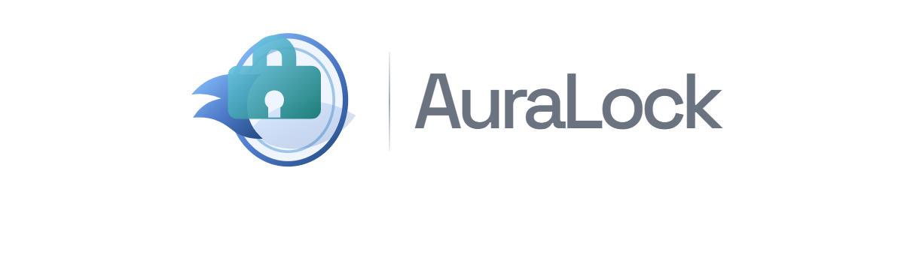
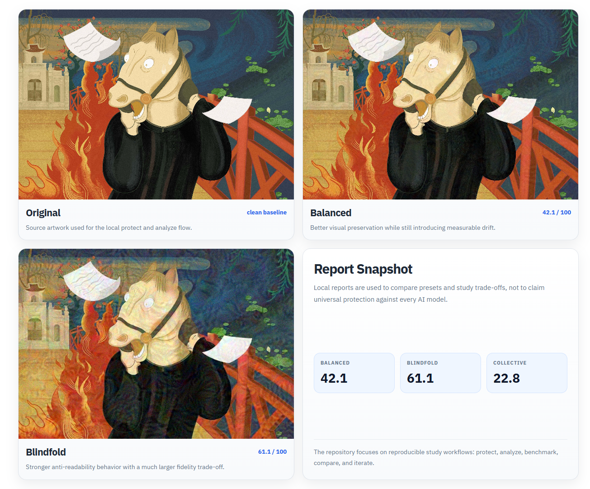

<p align="center">
  
</p>

<p align="center">
  <strong>A learning-focused toolkit for artwork cloaking, style-drift experiments, and benchmark-driven iteration.</strong><br/>
  Built for study, reproducibility, and honest anti-mimicry evaluation rather than marketing claims.
</p>

<p align="center">
  
  
  
  
  
  
  
</p>

<p align="center">
  <a href="#project-overview">Project Overview</a> |
  <a href="#system-snapshots">System Snapshots</a> |
  <a href="#workflow">Workflow</a> |
  <a href="#quick-start">Quick Start</a> |
  <a href="#minimum-requirements">Requirements</a>
</p>

## Project Overview

**AuraLock** is a study repository for artwork cloaking and anti-mimicry evaluation. It is designed for learning, experimentation, and benchmark-driven iteration, not for making impossible promises that every vision model can be fully blocked forever.

The repository is organized around a practical study loop:

- protect a single image or a directory with a chosen profile
- compare original and protected outputs with repeatable reports
- study stronger presets such as `subject`, `fortress`, and `blindfold`
- prepare subject-set or DreamBooth-style benchmark workflows for deeper evaluation

> You provide: artwork, a profile choice, and a benchmark target.  
> AuraLock returns: protected outputs, analysis reports, and reproducible benchmark artifacts.

## System Snapshots

<p align="center">
  
</p>

## Current Study Snapshot

Current local report highlights:

| Run | Protection Score | PSNR | SSIM | Notes |
|-----|------------------|------|------|-------|
| `balanced` | `42.1` | `36.24` | `0.9346` | better visual quality, good study baseline |
| `subject` | `51.5` | `30.53` | `0.8270` | stronger drift for subject-style protection experiments |
| `fortress` | `53.2` | `29.08` | `0.7858` | more aggressive, visibly harsher output |
| `blindfold` | `61.1` | `26.53` | `0.6114` | strongest current anti-readability preset, largest fidelity cost |
| `collective n000050 / set_B` | `22.8` avg | `37.78` avg | `0.9666` avg | correct benchmark direction, objective still needs tuning |

The `Protection Score` is an internal proxy derived from embedding and style similarity after robustness transforms. It is useful for relative comparisons inside this repository, not as a universal guarantee against all AI systems.

## Workflow

1. **Prepare input**: choose a single artwork, a folder, or a subject split such as `set_B`.
2. **Apply protection**: run `protect`, `batch`, or `batch --collective` with the profile you want to study.
3. **Analyze drift**: inspect PSNR, SSIM, and protection-oriented report values.
4. **Benchmark further**: compare profiles locally or generate DreamBooth / LoRA benchmark manifests.
5. **Iterate honestly**: tune profiles, compare results, and record where the current approach still falls short.

## Quick Start

### Prerequisites

| Tool | Requirement | Purpose | Check |
|------|-------------|---------|-------|
| Python | `3.10+` | core runtime | `python --version` |
| pip | recent version | package installation | `pip --version` |
| Optional: Docker | recent version | Docker runtime and benchmark path | `docker --version` |
| Optional: GPU runtime | CUDA-capable NVIDIA GPU | real DreamBooth / LoRA execution | `nvidia-smi` |

### Installation

```bash
git clone https://github.com/VoDaiLocz/Lock-ART.
cd Lock-ART.

python -m venv .venv
.\.venv\Scripts\activate

pip install -e ".[dev]"
```

Optional extras:

```bash
# Web UI
pip install -e ".[ui,dev]"

# DreamBooth / LoRA benchmark dependencies
pip install -e ".[benchmark,dev]"
```

### Common Commands

```bash
# Protect a single image
auralock protect artwork.png -o protected.png

# Save a stronger run with a JSON report
auralock protect artwork.png -o protected.png --profile strong --report reports/protect.json

# Analyze original vs protected
auralock analyze original.png protected.png --report reports/analyze.json

# Protect a directory
auralock batch ./artworks ./protected --recursive

# Collective subject-set protection
auralock batch ./.cache_ref/Anti-DreamBooth/data/n000050/set_B ./protected_subject ^
  --profile subject ^
  --collective ^
  --working-size 384 ^
  --report reports/batch-collective.json

# Compare multiple profiles
auralock benchmark artwork.png --profiles safe,balanced,strong --report reports/benchmark.json
```

### Optional Web UI

```bash
auralock webui --host 127.0.0.1 --port 7860
```

Open `http://127.0.0.1:7860` in your browser.

## Minimum Requirements

### Core CPU workflows

| Item | Minimum |
|------|---------|
| OS | Windows 10/11, Linux, or macOS |
| Python | `3.10+` |
| CPU | 2 cores |
| RAM | 8 GB |
| GPU | not required for `protect`, `batch`, or `analyze` |
| Disk | 5 GB free for the core install and reports |

This level is enough for:

- single-image protection on CPU
- directory batch protection on CPU
- report generation and analysis
- README asset generation with Playwright

### Recommended Environment

| Workflow | Recommended |
|----------|-------------|
| General CPU experimentation | 4+ CPU cores, 16 GB RAM |
| Optional web UI | core CPU setup plus a modern browser |
| Manifest planning / dry-run benchmarks | 16 GB RAM and extra disk space for checkpoints |
| Real DreamBooth / LoRA execution | CUDA-capable NVIDIA GPU, 12 GB+ VRAM, 16-32 GB system RAM, or a Colab / cloud GPU runtime |

Manifest planning can run on CPU. Real DreamBooth or LoRA execution should be treated as a GPU workflow.

## Profiles

| Profile | Goal | Default direction |
|---------|------|-------------------|
| `safe` | prioritize visual quality | low epsilon, light drift |
| `balanced` | balance quality and protection | best general-purpose study baseline |
| `strong` | push protection harder | higher drift, lower fidelity |
| `subject` | stronger preset for subject-style experiments | closer to Anti-DreamBooth-style runs |
| `fortress` | maximize protection within the current proxy approach | visible image changes |
| `blindfold` | aggressive anti-readability mode | strongest local score, harshest visual trade-off |

Adaptive CLI mode saves the output and report even when thresholds are missed, but returns a non-zero exit code so an automation pipeline does not mistake a weak result for a success.

## Repository Layout

```text
Lock-ART./
+-- .github/workflows/
+-- docs/
+-- notebooks/
+-- src/
|   +-- auralock/
|   |   +-- attacks/
|   |   +-- benchmarks/
|   |   +-- core/
|   |   +-- services/
|   |   +-- ui/
|   |   \-- cli.py
|   \-- tests/
+-- Dockerfile
+-- Dockerfile.benchmark
+-- docker-compose.yml
+-- docker-compose.benchmark.yml
\-- pyproject.toml
```

## Notes and Documentation

- [Product Audit](docs/PRODUCT_AUDIT.md)
- [Implementation Plan](docs/IMPLEMENTATION_PLAN.md)
- [Research Roadmap](docs/RESEARCH_ROADMAP.md)
- [Colab Benchmark Notebook](notebooks/AuraLock_LoRA_Benchmark_Colab.ipynb)

## Verification

```bash
pytest -q
ruff check src
black --check src
```

## Acknowledgements

AuraLock is a learning project shaped by ideas discussed around adversarial artwork protection and anti-mimicry evaluation, especially directions associated with Mist-v2, StyleGuard, Anti-DreamBooth, and related open research.

## License

This project is distributed under the **MIT License**. See [LICENSE](LICENSE).
