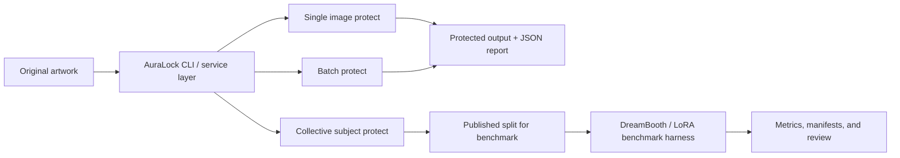

<p align="center">
  
</p>

<p align="center">
  <strong>A learning-focused toolkit for artwork cloaking, style-drift experiments, and benchmark-driven iteration.</strong><br/>
  Built for study, reproducibility, and honest anti-mimicry evaluation rather than marketing claims.
</p>

<p align="center">
  
  
  
  
  
  
  
</p>

<p align="center">
  <a href="#quick-start">Quick Start</a> •
  <a href="#cli-usage">CLI</a> •
  <a href="#profiles">Profiles</a> •
  <a href="#benchmark-snapshot">Benchmarks</a> •
  <a href="#minimum-requirements">Requirements</a>
</p>

## Overview

**AuraLock** is a study repository for artwork cloaking and anti-mimicry evaluation. It does not claim that all vision models can be permanently blocked. The goal is narrower and more honest:

- keep images usable for humans
- increase the cost of feature extraction or style mimicry workflows
- benchmark those trade-offs with repeatable reports instead of subjective demos

## Project Snapshot

| Area | Current state |
|------|---------------|
| **Core engine** | `StyleCloak` with `safe`, `balanced`, `strong`, `subject`, `fortress`, and `blindfold` profiles |
| **Operational modes** | single image, directory batch, adaptive guardrails, collective subject-set batch |
| **Benchmarking** | profile benchmark, LoRA manifest planning, Anti-DreamBooth split harness, Docker GPU path, Colab notebook |
| **Interfaces** | CLI, optional Gradio UI, JSON reports |
| **Project status** | learning project / alpha package metadata, not a finished commercial release |

## Quick Start

```bash
git clone https://github.com/VoDaiLocz/Lock-ART.
cd Lock-ART.

python -m venv .venv
.\.venv\Scripts\activate

pip install -e ".[dev]"
```

Optional extras:

```bash
# Web UI
pip install -e ".[ui,dev]"

# DreamBooth / LoRA benchmark dependencies
pip install -e ".[benchmark,dev]"
```

## CLI Usage

```bash
# Protect a single image
auralock protect artwork.png -o protected.png

# Protect with a stronger profile and save a JSON report
auralock protect artwork.png -o protected.png --profile strong --report reports/protect.json

# Adaptive mode: escalate profiles until thresholds are met or fail clearly
auralock protect artwork.png -o protected.png ^
  --auto-profiles safe,balanced,strong,subject,fortress,blindfold ^
  --min-protection-score 25 ^
  --min-ssim 0.92 ^
  --min-psnr 35 ^
  --report reports/protect-adaptive.json

# Aggressive anti-readability mode
auralock protect artwork.png -o protected-blindfold.png --profile blindfold

# Protect an entire directory
auralock batch ./artworks ./protected --recursive

# Collective subject-set protection
auralock batch ./.cache_ref/Anti-DreamBooth/data/n000050/set_B ./protected_subject ^
  --profile subject ^
  --collective ^
  --working-size 384 ^
  --report reports/batch-collective.json

# Compare original and protected images
auralock analyze original.png protected.png --report reports/analyze.json

# Compare multiple profiles on one file or directory
auralock benchmark artwork.png --profiles safe,balanced,strong --report reports/benchmark.json

# Create a DreamBooth / LoRA benchmark manifest
auralock benchmark-lora ./artworks ^
  --work-dir benchmark_runs/lora ^
  --pretrained-model-path ./stable-diffusion/stable-diffusion-1-5 ^
  --script-path ./.cache_ref/Anti-DreamBooth/train_dreambooth_lora.py ^
  --instance-prompt "a sks painting" ^
  --class-prompt "a painting" ^
  --report reports/lora-manifest.json

# Plan a benchmark aligned with Anti-DreamBooth subject splits
auralock benchmark-antidreambooth ./.cache_ref/Anti-DreamBooth/data/n000050 ^
  --profiles safe ^
  --pretrained-model-path ./stable-diffusion/stable-diffusion-2-1-base ^
  --report reports/antidreambooth-manifest.json

# Optional web UI
auralock webui --host 127.0.0.1 --port 7860
```

## Python API

```python
from auralock import ProtectionService
from auralock.core.image import save_image

service = ProtectionService()
result = service.protect_file("artwork.png", profile="balanced")

save_image(result.protected_tensor, "protected.png")
print(result.quality_report)
print(result.protection_report)
print(result.to_report_dict(output_path="protected.png"))
```

## Profiles

| Profile | Goal | Default direction |
|---------|------|-------------------|
| `safe` | Prioritize visual quality | low epsilon, light drift |
| `balanced` | Balance quality and protection | best general-purpose learning baseline |
| `strong` | Push protection harder | higher drift, lower fidelity |
| `subject` | Stronger preset for subject-style experiments | closer to Anti-DreamBooth-style runs |
| `fortress` | Maximize protection within the current proxy approach | visible image changes |
| `blindfold` | Aggressive anti-readability mode | strongest local score, harshest visual trade-off |

Adaptive CLI mode saves the output and report even when thresholds are missed, but returns a non-zero exit code so an automation pipeline does not mistake a weak result for a success.

## Benchmark Snapshot

Current local report highlights:

| Run | Protection Score | PSNR | SSIM | Notes |
|-----|------------------|------|------|-------|
| `balanced` | `42.1` | `36.24` | `0.9346` | better visual quality, good study baseline |
| `subject` | `51.5` | `30.53` | `0.8270` | stronger drift for subject-style protection experiments |
| `fortress` | `53.2` | `29.08` | `0.7858` | more aggressive, visibly harsher output |
| `blindfold` | `61.1` | `26.53` | `0.6114` | strongest current anti-readability preset, largest fidelity cost |
| `collective n000050 / set_B` | `22.8` avg | `37.78` avg | `0.9666` avg | correct benchmark direction, objective still needs tuning |

The `Protection Score` is an internal proxy derived from embedding and style similarity after robustness transforms. It is useful for comparisons inside this repository, not as a universal guarantee against every AI system.

## Workflow



## Minimum Requirements

### Core CPU workflows

| Item | Minimum |
|------|---------|
| OS | Windows 10/11, Linux, or macOS |
| Python | `3.10+` |
| CPU | 2 cores |
| RAM | 8 GB |
| GPU | not required for `protect`, `batch`, or `analyze` |
| Disk | 5 GB free for the core install and reports |

This level is enough for:

- single-image protection on CPU
- directory batch protection on CPU
- report generation and analysis
- README asset generation with Playwright

### Recommended environment

| Workflow | Recommended |
|----------|-------------|
| General CPU experimentation | 4+ CPU cores, 16 GB RAM |
| Optional web UI | the core CPU setup plus a modern browser |
| Manifest planning / dry-run benchmarks | 16 GB RAM and extra disk space for checkpoints |
| Real DreamBooth / LoRA execution | CUDA-capable NVIDIA GPU, 12 GB+ VRAM, 16-32 GB system RAM, or a Colab / cloud GPU runtime |

Manifest planning can run on CPU. Real DreamBooth or LoRA execution should be treated as a GPU workflow.

## Project Structure

```text
Lock-ART./
├── .github/workflows/
├── docs/
├── notebooks/
├── src/
│   ├── auralock/
│   │   ├── attacks/
│   │   ├── benchmarks/
│   │   ├── core/
│   │   ├── services/
│   │   ├── ui/
│   │   └── cli.py
│   └── tests/
├── Dockerfile
├── Dockerfile.benchmark
├── docker-compose.yml
├── docker-compose.benchmark.yml
└── pyproject.toml
```

## Documentation

- [Product Audit](docs/PRODUCT_AUDIT.md)
- [Implementation Plan](docs/IMPLEMENTATION_PLAN.md)
- [Research Roadmap](docs/RESEARCH_ROADMAP.md)
- [Colab Benchmark Notebook](notebooks/AuraLock_LoRA_Benchmark_Colab.ipynb)

## Verification

```bash
pytest -q
ruff check src
black --check src
```

## Release and Package Notes

- The package metadata currently lives in [`pyproject.toml`](pyproject.toml) as `auralock` version `0.1.0`.
- No public GitHub release is tagged yet.
- The repository should be treated as an alpha learning project, not a finished commercial product.

## License

This project is distributed under the **MIT License**. See [LICENSE](LICENSE).

## Author

**locfaker**

- GitHub: [@locfaker](https://github.com/locfaker)
