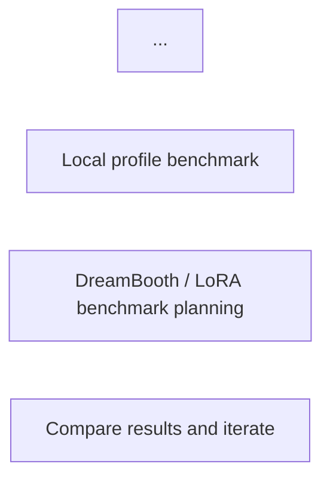

# Issue: Misleading Benchmark Framing in README - Unvalidated Claims Presented as Facts

## Labels
`documentation`, `benchmark`, `critical`, `user-facing`, `misleading`

## Problem Description

The README presents benchmark results and protection claims using **definitive language that implies validation**, when in fact results are based entirely on unvalidated proxy metrics. Critical limitations are buried in fine print while headline claims suggest proven effectiveness. This framing misleads users into believing the protection has been rigorously validated when it has not.

## What is Wrong with the Benchmark Framing

### 1. Definitive Claims Without Validation Disclaimers

**README line 6-8**:
```markdown
<strong>A learning-focused toolkit for artwork cloaking, style-drift experiments, and benchmark-driven iteration.</strong><br/>
Built for study, reproducibility, and honest anti-mimicry evaluation rather than marketing claims.
```

Claims "honest anti-mimicry evaluation" but:
- No actual mimicry evaluation (LoRA/DreamBooth training) published
- Results based entirely on proxy metrics
- "Honest" framing contradicts incomplete evaluation

**README line 48-50 ("Current Study Snapshot")**:
```markdown
## Current Study Snapshot

Current local report highlights:
```

"Current local report" suggests these are preliminary, but table that follows uses definitive language:

**README lines 54-58**:
```markdown
| `balanced` | `42.1` | `36.24` | `0.9346` | better visual quality, good study baseline |
| `subject` | `51.5` | `30.53` | `0.8270` | stronger drift for subject-style protection experiments |
| `fortress` | `53.2` | `29.08` | `0.7858` | more aggressive, visibly harsher output |
| `blindfold` | `61.1` | `26.53` | `0.6114` | strongest current anti-readability preset, largest fidelity cost |
```

**Framing issues**:
- "stronger drift" implies effectiveness, not just feature space drift
- "strongest current anti-readability" makes absolute claim
- No visible warnings that these are proxy scores, not validated protection
- Numbers presented without error bars, confidence intervals, or sample sizes

### 2. Critical Disclaimer Buried After Results

**README line 60** (after results table):
```markdown
The `Protection Score` is an internal proxy derived from embedding and style similarity after robustness transforms. It is useful for relative comparisons inside this repository, not as a universal guarantee against all AI systems.
```

**Problem**: This critical limitation appears **after** the results, not before:
- Users see impressive numbers first
- Form impression of strong protection
- May not read fine print disclaimer
- Classic "dark pattern" in presentation

**Better framing would put disclaimer FIRST**:
```markdown
⚠️ **Important Limitation**: All scores below are proxy metrics (feature drift in ResNet18 space), NOT validated against actual mimicry models. Real-world effectiveness is unknown. See [Ground-Truth Validation Issue](#).

| Profile | Protection Score (proxy) | PSNR | SSIM | ...
```

### 3. Suggestive Profile Names Imply Validation

**Profile names** (README lines 183-191):
```markdown
| `fortress` | maximize protection within the current proxy approach | visible image changes |
| `blindfold` | aggressive anti-readability mode | strongest local score, harshest visual trade-off |
```

**Framing issues**:
- "fortress" suggests impenetrable defense (not proven)
- "blindfold" suggests complete blocking of readability (not validated against actual models)
- "maximize protection" is only within proxy space, not actual protection

**More honest names**:
- `fortress` → `high_proxy_score` or `aggressive_perturbation`
- `blindfold` → `maximum_drift` or `extreme_perturbation`

### 4. "Benchmark" Terminology Suggests Validation

**Multiple uses of "benchmark"**:
- README section: "Current Study Snapshot" (line 48)
- CLI command: `auralock benchmark` (line 139)
- Documentation: "Benchmark Design" (docs/system-design/10_BENCHMARK_DESIGN.md)

**But**: What's called "benchmark" is actually **profile comparison on proxy metrics**, not validation against actual mimicry.

**Misleading terminology**:
- "Benchmark" implies comparison against ground truth or baselines
- Users expect "benchmarked" systems have been validated
- Reality: Only internal profile comparisons on proxy metrics

**More honest terminology**:
- "Profile Comparison" instead of "Benchmark"
- "Proxy Metric Evaluation" instead of "Benchmark Results"
- "Preliminary Analysis" instead of "Current Study Snapshot"

### 5. Repository Description Overstates Capabilities

**README line 30** (Project Overview):
```markdown
**AuraLock** is a study repository for artwork cloaking and anti-mimicry evaluation.
```

"Anti-mimicry evaluation" suggests evaluation has been done. But:
- No published mimicry evaluation results
- Infrastructure exists (LoRA benchmark harness) but unused
- Only proxy metrics have been evaluated

**More accurate**:
```markdown
**AuraLock** is a study repository for artwork cloaking and **developing** anti-mimicry evaluation **methodology**.
```

### 6. Workflow Diagram Implies Validation

**README lines 70-81** (Workflow diagram):


**Shows**: "DreamBooth / LoRA benchmark planning" (step H)

**Implies**: This is part of the standard workflow

**Reality**: Step H is infrastructure that exists but has never been executed with published results. The diagram makes it seem like ground-truth validation is standard practice, when it's actually missing.

### 7. Acknowledgements Suggest Validation Parity

**README line 243**:
```markdown
AuraLock is a learning project shaped by ideas discussed around adversarial artwork protection and anti-mimicry evaluation, especially directions associated with Mist-v2, StyleGuard, Anti-DreamBooth, and related open research.
```

**By mentioning** Mist, StyleGuard, Anti-DreamBooth (all rigorously evaluated methods):
- Creates association with validated approaches
- Users may assume AuraLock has similar validation rigor
- **Reality**: AuraLock has not published comparable validation

**More honest**:
```markdown
AuraLock is inspired by Mist-v2, StyleGuard, Anti-DreamBooth, and related research. **Unlike these methods, AuraLock has not yet undergone ground-truth mimicry validation.** See Issue #X for validation roadmap.
```

### 8. Claims of "Honest" Framing Are Contradictory

**README line 7-8**:
```markdown
Built for study, reproducibility, and honest anti-mimicry evaluation rather than marketing claims.
```

**But the very next sections**:
- Present unvalidated results without prominent warnings (line 52-58)
- Use marketing-style profile names ("fortress", "blindfold")
- Bury critical limitations after impressive numbers
- Frame proxy metrics as "benchmark results"

**This is exactly what marketing does**: Eye-catching claims up front, disclaimers in fine print.

**Contradiction**: Can't claim "honest evaluation" while using marketing presentation patterns.

## Why This Can Mislead Users

### Scenario 1: User Deploys Ineffective Protection

Artist reads README:
```markdown
| `fortress` | `53.2` | ... | maximize protection within the current proxy approach
```

Artist thinks:
- "Fortress profile provides maximum protection"
- "53.2 score is strong, validated protection"
- "This will prevent AI from copying my style"

Artist deploys fortress profile on entire portfolio:
- Images are visibly degraded (PSNR=29.08, SSIM=0.7858)
- But protection may actually be weak (not validated)
- AI models may still successfully copy style
- Artist lost quality for questionable protection benefit

### Scenario 2: False Security

Scenario:
1. Artist uses AuraLock protection
2. Shares "protected" images publicly
3. Assumes style is safe from mimicry
4. Competitor trains DreamBooth on "protected" images
5. Protection fails (was never validated to work)
6. Artist's style is copied despite protection

**Artist trusted "benchmark results" that were never validated against actual mimicry.**

### Scenario 3: Institutional Deployment

Art platform reads:
```markdown
Built for study, reproducibility, and honest anti-mimicry evaluation
```

Platform assumes:
- AuraLock has been rigorously evaluated
- Protection effectiveness is validated
- Can deploy as defense for artists on platform

Platform integrates AuraLock:
- Markets as "AI protection" to artists
- Artists pay premium for protected uploads
- Protection may be ineffective (not validated)
- Platform liable for false security claims

### Scenario 4: Academic Misattribution

Researcher cites AuraLock:
```
[12] demonstrated effective artwork protection with fortress profile achieving 53.2 protection score...
```

**Implied**: Protection has been validated

**Reality**: Only proxy metrics measured, no ground truth

**Result**: Misleading citation propagates through literature

## Evidence of Misleading Framing

### 1. Disclaimer Placement

Critical limitation (line 60) appears **after** impressive results (lines 52-58):
- Classic persuasion technique: Impact first, limitations later
- Many users won't read past results table
- Contradicts claim of "honest evaluation"

### 2. Comparison with Honest Framing

**Current (misleading)**:
```markdown
## Current Study Snapshot

| `fortress` | `53.2` | `29.08` | `0.7858` | more aggressive, visibly harsher output |

The Protection Score is an internal proxy... not as a universal guarantee.
```

**Honest framing would be**:
```markdown
## Current Study Snapshot (PROXY METRICS ONLY - NOT VALIDATED)

⚠️ **Critical Limitation**: All scores are unvalidated proxy metrics. Real-world protection effectiveness is unknown. See Issue #X.

| Profile | Proxy Score (ResNet18 drift) | PSNR | SSIM | Notes |
| `fortress` | `53.2` (unvalidated) | `29.08` | `0.7858` | High feature drift, visual quality loss. Real protection unknown. |

**Need for Validation**: See Issue #X for ground-truth LoRA/DreamBooth validation roadmap.
```

### 3. GitHub Repository Description

Repository tagline:
> "A learning-focused toolkit for artwork cloaking, style-drift experiments, and benchmark-driven iteration."

**"Cloaking" suggests hiding artwork from AI detection**. This is the intended capability, but:
- Not validated to work
- May provide false sense of security
- More accurate: "A toolkit for **studying** artwork cloaking..."

### 4. Badge Display

README lines 11-17 show badges:
```markdown


```

**Gives impression of** mature, validated software. But:
- Tests validate code functionality, not protection effectiveness
- No badge for "ground-truth validation: NONE"
- No badge for "mimicry prevention: NOT MEASURED"

**More honest badge set would include**:
```markdown


```

## Proposed Fixes

### Fix 1: Prominent Disclaimers at Top of README

Add to README immediately after project overview (before results):
```markdown
## ⚠️ Current Validation Status

**IMPORTANT: All protection scores are unvalidated proxy metrics.**

| Status | Description |
|--------|-------------|
| ✅ **Implemented** | Feature extraction, proxy metrics, profile comparison |
| ✅ **Implemented** | LoRA/DreamBooth benchmark infrastructure |
| ❌ **Missing** | Ground-truth mimicry validation results |
| ❌ **Missing** | Comparison against academic baselines (Anti-DreamBooth, Mist) |
| ❌ **Missing** | Independent verification of protection effectiveness |

**What This Means for Users**:
- Protection scores measure ResNet18 feature drift, NOT actual mimicry prevention
- No evidence that protection prevents DreamBooth/LoRA from learning your style
- Use at your own risk; effectiveness is unproven

**Validation Roadmap**: See [Issue #X](#) for ground-truth validation plan.
```

### Fix 2: Reframe Results Table with Warnings

Update results table (lines 52-58):
```markdown
## Current Study Snapshot (Proxy Metrics - Unvalidated)

⚠️ All scores below are **proxy metrics only**. Real-world protection effectiveness has **not been validated** against actual mimicry models.

| Profile | Protection Score<br/>(proxy, unvalidated) | PSNR | SSIM | Validation Status |
|---------|-------------------------------------------|------|------|-------------------|
| `balanced` | `42.1` | `36.24` | `0.9346` | ❌ No ground-truth validation |
| `fortress` | `53.2` | `29.08` | `0.7858` | ❌ No ground-truth validation |
| `blindfold` | `61.1` | `26.53` | `0.6114` | ❌ No ground-truth validation |

**Protection Score Interpretation**:
- Measures: Feature drift in ResNet18 space after robustness transforms
- Does NOT measure: Actual prevention of style mimicry by DreamBooth/LoRA
- Correlation with mimicry prevention: **Unknown** (not validated)

**Before deploying**: Understand that protection effectiveness is unproven. See [Validation Status](#) section above.
```

### Fix 3: Honest Profile Names and Descriptions

Update profile table (lines 183-191):
```markdown
| Profile | Goal | Status |
|---------|------|--------|
| `safe` | Low perturbation, prioritize quality | ⚠️ Protection unvalidated |
| `balanced` | Medium perturbation, balance quality/proxy-score | ⚠️ Protection unvalidated |
| `strong` | Higher perturbation, increase proxy score | ⚠️ Protection unvalidated |
| `fortress` | Maximum proxy score (may not equal real protection) | ⚠️ Protection unvalidated |
| `blindfold` | Highest feature drift (real effectiveness unknown) | ⚠️ Protection unvalidated |

**Important**: Profile names suggest protection strength, but this is based on unvalidated proxy metrics. Real-world effectiveness is unknown.
```

### Fix 4: Accurate Benchmark Terminology

Replace all instances of:
- "benchmark results" → "proxy metric comparison"
- "benchmark" command → "compare-profiles" or "evaluate-metrics"
- "protection score" → "proxy protection score" or "feature drift score"

Update CLI:
```bash
# OLD (misleading)
$ auralock benchmark artwork.png --profiles safe,balanced,strong

# NEW (honest)
$ auralock compare-profiles artwork.png --profiles safe,balanced,strong
# or
$ auralock evaluate-proxy-metrics artwork.png --profiles safe,balanced,strong
```

### Fix 5: Validation Status Badges

Add honest status badges to README:
```markdown


```

### Fix 6: Update Repository Description

**GitHub repository description** (currently):
> "A learning-focused toolkit for artwork cloaking, style-drift experiments, and benchmark-driven iteration."

**Should be**:
> "A research toolkit for studying adversarial artwork protection. Validation against real mimicry models is ongoing. Protection effectiveness not yet proven."

### Fix 7: Add "Limitations" Section to README

Add prominent limitations section:
```markdown
## Known Limitations

### Validation Gaps
- ❌ No ground-truth mimicry validation (LoRA/DreamBooth training on protected images)
- ❌ No comparison against academic baselines (Anti-DreamBooth, Mist, Glaze)
- ❌ No independent verification of protection claims
- ❌ Proxy metrics may not correlate with actual protection

### Robustness Gaps
- ❌ No JPEG compression testing (most common purification attack)
- ❌ Limited transform suite (4 transforms, missing CLIP/VAE preprocessing)
- ❌ Single feature extractor (ResNet18 only, not CLIP/DINO)

### Methodology Gaps
- ❌ No train/val/test split enforcement (risk of overfitting)
- ❌ No reproducibility infrastructure (missing environment capture)
- ❌ Cherry-picking not prevented (no systematic validation)

**For detailed technical analysis, see**:
- [Issue #1: Proxy Metrics Don't Reflect Real Protection](#)
- [Issue #2: Missing Ground-Truth Validation](#)
- [Issue #3: Weak Robustness Testing](#)
- [Additional issues...](#)

**Users should understand these limitations before deploying protection.**
```

## Acceptance Criteria

### Phase 1: Immediate Disclaimer Fixes (Week 1)
- [ ] Add prominent "⚠️ Current Validation Status" section at top of README
- [ ] Reframe results table with "proxy, unvalidated" labels
- [ ] Move critical disclaimer from line 60 to before results (line 50)
- [ ] Update all "protection score" references to "proxy protection score"

### Phase 2: Terminology Fixes (Week 1-2)
- [ ] Replace "benchmark" with "proxy metric comparison" in user-facing docs
- [ ] Rename `auralock benchmark` to `auralock compare-profiles` or add `--proxy-only` flag
- [ ] Update profile descriptions to clarify proxy-only validation
- [ ] Add "Limitations" section to README

### Phase 3: Badge and Metadata Updates (Week 2)
- [ ] Add validation status badges (red for missing validation)
- [ ] Update repository description to emphasize research/unvalidated status
- [ ] Add "research prototype" / "unvalidated" label to GitHub topics

### Phase 4: Documentation Consistency (Week 2-3)
- [ ] Audit all documentation for definitive claims without disclaimers
- [ ] Add validation status to all benchmark-related docs
- [ ] Update workflow diagram to show missing validation steps
- [ ] Add "Known Limitations" to contributing guide

### Phase 5: User-Facing Warnings (Week 3)
- [ ] Add CLI warnings when protection commands are used:
  ```
  ⚠️ Warning: Protection effectiveness not validated against real mimicry models.
  Proxy metrics only. Use at your own risk. See docs/LIMITATIONS.md
  ```
- [ ] Add warnings to all JSON reports
- [ ] Add warnings to web UI (if applicable)

### Phase 6: Honest Communication Policy (Ongoing)
- [ ] Establish policy: Never claim protection without validation evidence
- [ ] PR template checklist: "Does this claim require validation evidence?"
- [ ] CI check: Flag PRs that add benchmark claims without disclaimers
- [ ] Community guideline: Encourage honest reporting of limitations

## Additional Context

### Analogy: Medical Drug Trials

Imagine a pharmaceutical company:
```
Drug X showed promising results in cell culture studies!
[Shows impressive charts]

*fine print: Not tested in animals or humans. Safety and efficacy unproven.
```

**This would be unacceptable**. Cell culture (proxy) is not enough. Must validate in actual patients (ground truth).

**Same principle applies here**:
- ResNet18 feature drift (proxy) is not enough
- Must validate against actual mimicry models (ground truth)
- Can't market as "protection" without validation

### Defense Against Criticism

Some may argue:
> "But we disclosed it's a learning project / research prototype / proxy metric!"

**Response**:
- Disclosures must be **prominent**, not buried
- Can't offset misleading framing with fine print
- Research prototypes must be clearly labeled as such **everywhere**
- "Honest evaluation" claim sets higher standard

### Precedent: Security Vulnerability Disclosure

When security researchers find vulnerabilities:
- Use clear, unambiguous language
- Put severity ratings up front (CRITICAL, HIGH, MEDIUM, LOW)
- Don't bury impact in fine print

**Same principle for unvalidated protection**:
- Validation status should be first thing users see
- Can't hide "not validated" in paragraph 3

## References

- README.md lines 6-8 - Claims "honest evaluation" without validation
- README.md lines 52-58 - Results without prominent validation warnings
- README.md line 60 - Critical disclaimer buried after results
- README.md lines 183-191 - Suggestive profile names without validation
- Repository description - "Cloaking" implies proven effectiveness
- FTC guidance on disclosure requirements for material claims
- ACM Code of Ethics - Honest representation of capabilities
